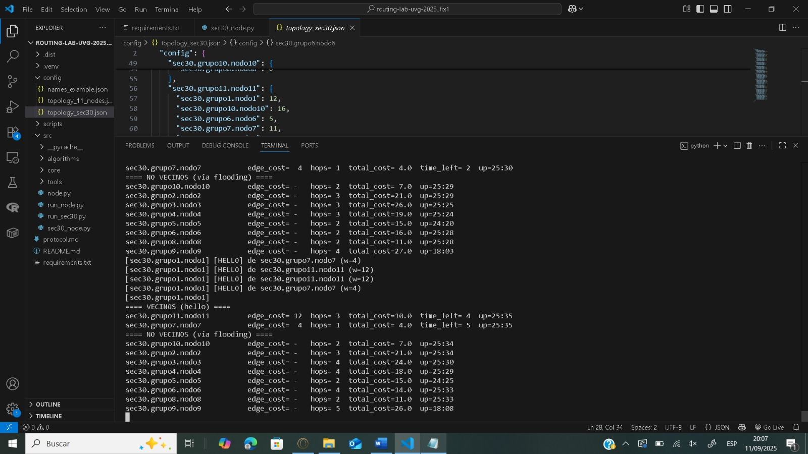

# Cómo correr

# Crear entorno virtual (opcional) e instalar dependencias

python -m venv .venv
.venv\Scripts\Activate.ps1
pip install -r requirements.txt

Levantar nodos (ejemplo con nodo1, nodo7 y nodo8)

# Ventana A (tu nodo1)
python -m src.run_sec30 --id sec30.grupo1.nodo1 --topo config/topology_sec30.json --show-table --dijkstra sec30.grupo10.nodo10

# Ventana B (vecino nodo7)
python -m src.run_sec30 --id sec30.grupo7.nodo7 --topo config/topology_sec30.json --show-table

# Ventana C (no vecino nodo8)
python -m src.run_sec30 --id sec30.grupo8.nodo8 --topo config/topology_sec30.json --show-table

Qué esperar en la salida

Vecinos (hello)

==== VECINOS (hello) ====
sec30.grupo7.nodo7    edge_cost=  4  hops= 1  total_cost=  4  time_left= 6  up=00:15
sec30.grupo11.nodo11  edge_cost= 12  hops= 1  total_cost= 12  time_left= 6  up=00:15

No vecinos (flooding)

==== NO VECINOS (vía flooding) ====
sec30.grupo8.nodo8    edge_cost= -   hops= 2  total_cost= 11  up=00:08
